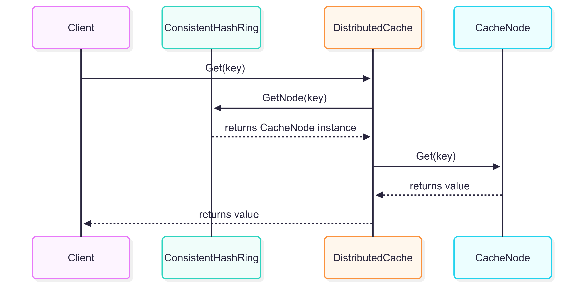
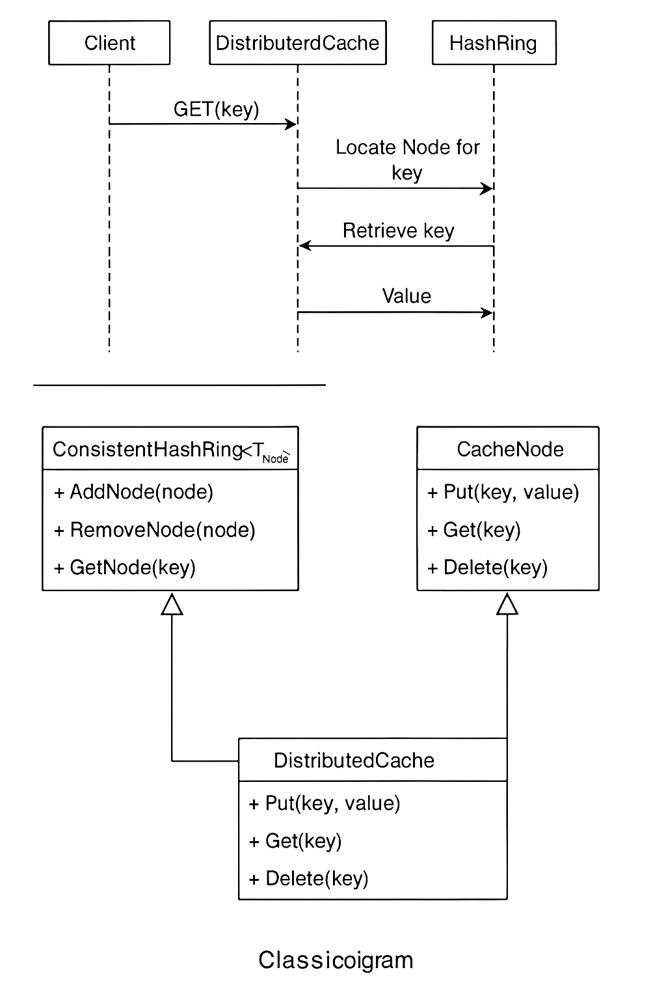

# 🧩 Distributed Caching System with Consistent Hashing in C# and .NET

## 📘 Introduction

In distributed caching systems, a common challenge is how to **evenly distribute keys** across multiple cache nodes and **minimize disruption** when nodes join or leave the system. Traditional modulo-based hashing (e.g., `hash(key) % N`) suffers from high key remapping when the number of nodes (`N`) changes.

**Consistent Hashing** solves this problem by organizing nodes in a hash ring. It ensures only a small subset of keys need to be remapped when nodes are added or removed—thereby improving scalability, fault tolerance, and efficiency in distributed systems.

---

## 🧠 Part 1: High-Level Design (HLD)

### ✅ Objective
Create a scalable distributed caching system using consistent hashing that:
- Evenly distributes keys across nodes
- Minimizes rehashing during node addition/removal
- Provides simple PUT, GET, DELETE operations

### 📦 Components

| Component              | Responsibility                                                                 |
|------------------------|--------------------------------------------------------------------------------|
| `Client`               | Makes requests to the cache layer                                              |
| `DistributedCache`     | Routes requests to the correct cache node using consistent hashing             |
| `CacheNode`            | Stores key-value pairs in memory                                               |
| `ConsistentHashRing`   | Maintains a ring of virtual nodes and maps keys to cache nodes                 |

### ⚙️ Functional Requirements
- PUT, GET, DELETE keys
- Add and remove nodes with minimal disruption

### 🧰 Non-Functional Requirements
- Low latency
- Fault tolerance
- Scalability
- High availability

---

## 🔧 Part 2: Low-Level Design (LLD)

### 📐 Class Diagram

+--------------------------+ | ConsistentHashRing<T> | +--------------------------+ | +AddNode(node) | | +RemoveNode(node) | | +GetNode(key) | +--------------------------+

+--------------------------+ | CacheNode | +--------------------------+ | +Put(key, value) | | +Get(key) | | +Delete(key) | +--------------------------+

+--------------------------+ | DistributedCache | +--------------------------+ | +Put(key, value) | | +Get(key) | | +Delete(key) | +--------------------------+

### 📤 Sequence Diagram – GET Operation

Client → DistributedCache : GET("banana") DistributedCache → HashRing : GetNode("banana") HashRing → DistributedCache : Node-B DistributedCache → Node-B : Get("banana") Node-B → DistributedCache : "yellow" DistributedCache → Client : "yellow"

---

## 🖼️ Architecture Diagrams

### 🧭 Sequence Diagram – Visual

### 🧱 Class Diagram – Visual

> _Note: Replace the placeholder URLs above with your own rendered PlantUML/Visual diagrams if hosting externally or using an editor like draw.io._

---

## 📚 Keywords & Trigger Words (For Interviews & Repos)

- Consistent Hashing
- Distributed Caching
- Hash Ring
- Virtual Nodes
- Node Rebalancing
- Fault Tolerance
- Scalability
- System Design
- Key Sharding
- Cache Partitioning

---

## 💬 Want to Extend It?

Ideas for enhancements:
- Add node replication for fault tolerance
- Use gRPC for inter-node communication
- Store data in Redis instead of memory
- Add a dashboard for node status and key distribution

---

🛠️ Built with ❤️ in .NET for showcasing system design expertise.

